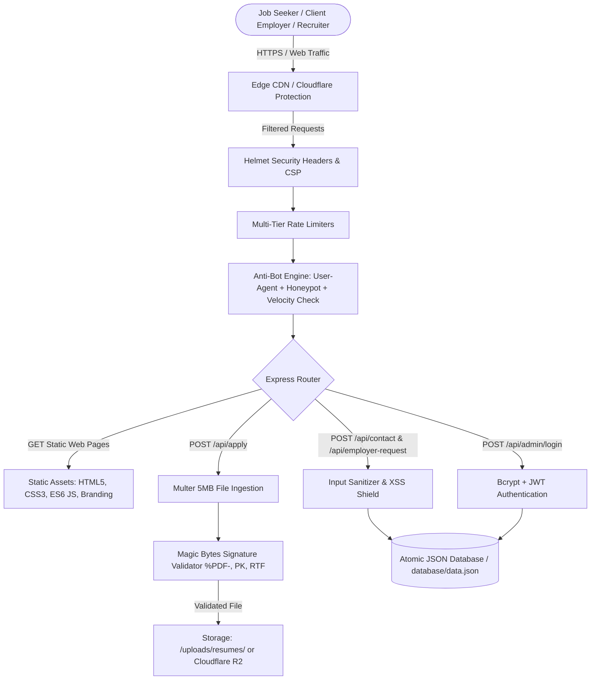

# CareerLine Solution - Architecture Blueprint (`architecher.md`)

## 1. Executive Architecture Summary
CareerLine Solution is a high-performance recruitment and corporate HR consultancy platform engineered for Pan-India staffing operations. The application architecture balances lightweight speed, zero external SaaS dependencies, robust multi-layer cybersecurity, and complete brand fidelity.



---

## 2. Technology Stack & Component Matrix

| Layer | Technologies Used | Responsibility |
| :--- | :--- | :--- |
| **Frontend Presentation** | HTML5 Semantic Markup, Vanilla CSS3 (Custom Design System), FontAwesome 6, Google Inter Font | High-contrast, responsive UI with zero bloated UI frameworks |
| **Client Logic** | Modern JavaScript (ES6+), Fetch API, LocalStorage Session Management | Real-time job filtering, dynamic search, modals, anti-bot timestamp tokens |
| **Application Server** | Node.js (v20+ / v22+), Express.js (v5.x) | REST API endpoints, routing, static page delivery, authentication |
| **Security Layer** | Helmet.js, Express-Rate-Limit, Custom Anti-Bot Middleware | CSP, Frameguard, brute-force defense, anti-scraping, honeypot traps |
| **File Processing** | Multer (v2.x), Binary Magic Byte Buffer Analysis | Secure resume intake (PDF/DOCX), double-extension rejection, MIME checks |
| **Data Persistence** | Atomic Flat-File Database (`database/db.js`), Bcryptjs, JWT | High-speed JSON storage with atomic temp-file renaming, salted password hashes |

---

## 3. Request Lifecycle & Multi-Tier Defense Pipeline

Every incoming HTTP request traverses an isolated defense pipeline before reaching application business logic:

```
[Request]
   │
   ▼
1. Helmet Security Headers (Strict CSP, X-Frame-Options, X-Content-Type-Options: nosniff, HSTS)
   │
   ▼
2. Body Parsers with Strict Size Limits (100KB JSON / 100KB Form Data to stop memory DOS)
   │
   ▼
3. Rate Limiting Enforcers:
   • /api/ (Global): Max 120 req/min per IP
   • /api/apply: Max 5 submissions per 15 min per IP
   • /api/contact & /api/employer-request: Max 6 submissions per 15 min per IP
   • /api/admin/login: Max 5 attempts per 15 min per IP
   │
   ▼
4. Anti-Bot Engine:
   • User-Agent Screening: Instant 403 on scrapers, sqlmap, nikto, scrapy, etc.
   • Hidden Honeypot Check: Instant 400 on hidden field tampering
   • Timing Velocity Check: Instant 400 if form submitted under 1500ms
   │
   ▼
5. File Magic Byte Analysis (For /api/apply):
   • Verifies binary header (%PDF-, PK\x03\x04, {\rtf)
   • Unlinks & deletes corrupt or spoofed payloads immediately
   │
   ▼
6. Business Logic & Controller Execution
   │
   ▼
7. Atomic Database Write (.tmp atomic rename) -> Clean JSON Response
```

---

## 4. Directory & Module Architecture

```
CareerLineSolution/
├── admin/                      # Admin portal entry point
│   ├── index.html              # Recruiter management console
│   └── login.html              # Recruiter authentication interface
├── assets/                     # Core branding & identity assets
│   └── company_logos/          # Primary client logos, transparent PNGs, favicons
│       ├── careerline-logo-horizontal.png  # Header transparent brand mark
│       ├── careerline-logo-footer.png      # Dark-theme transparent footer mark
│       └── careerline-logo-emblem.png      # Isolated 3D hexagon shield
├── css/                        # Global modular stylesheet
│   └── style.css               # Design system, responsive grid, components
├── database/                   # Persistence module
│   ├── db.js                   # Atomic read/write operations & initial seed
│   └── data.json               # Flat-file database (Jobs, Applications, Settings)
├── docs/                       # GitHub Pages / static mirror distribution
├── images/                     # Corporate showcase photography
├── js/                         # Frontend client scripts
│   ├── data-store.js           # Client cache & settings helper
│   ├── jobs.js                 # Dynamic job directory, search & application modal
│   └── main.js                 # Global navigation, drawer, toast alerts, honeypot init
├── public/                     # Express static root serving all client pages
│   ├── index.html              # Homepage
│   ├── about.html              # Corporate story & milestones
│   ├── services.html           # HR & staffing solutions
│   ├── employers.html          # Corporate client inquiry portal
│   ├── jobs.html               # Pan-India job discovery engine
│   ├── contact.html            # Branch & inquiry center
│   ├── privacy.html            # Official Privacy Policy
│   ├── terms.html              # Terms & Conditions of service
│   └── robots.txt              # Search engine & anti-crawler directive
├── uploads/                    # Physical upload directory
│   └── resumes/                # Sanitized candidate CV storage
├── package.json                # Project dependencies & scripts
├── server.js                   # Express core entry point & security engine
├── architecher.md              # System Architecture (This file)
├── desgin.md                   # Brand Identity & UI Design System
├── memory.md                   # Project History & Key Client Decisions
├── PRD.md                      # Product Requirements Document
├── Rules.Md                    # Engineering Standards & Security Guidelines
└── tasks.md                    # Project Milestone & Task Tracker
```

---

## 5. Deployment Options & Scaling Roadmap

### Phase 1: Local / Single-Node VPS (Current)
* Node.js Express process runs on port `5000` via PM2 or systemd.
* Static files served directly via `express.static('public')`.
* Uploads stored on local disk in `uploads/resumes/`.

### Phase 2: Cloudflare Hybrid Production (Recommended Free Scaling)
* **Frontend**: Hosted on **Cloudflare Pages** (Infinite bandwidth, free SSL, global CDN edge caching).
* **Backend API**: Hosted on **Render / Railway / VPS** with reverse proxy.
* **Resume Storage**: Replaced local `multer.diskStorage` with **Cloudflare R2** (10 GB free forever, zero bandwidth costs, stores ~25,000 resumes).
* **Database**: Kept as JSON flat file or upgraded to **Cloudflare D1** (Serverless SQLite, 5 GB free).
